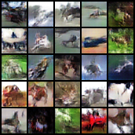

### SphereGAN-Pytorch-implementation

---

Pytorch implementation of [SphereGAN](<http://cau.ac.kr/~jskwon/paper/SphereGAN_CVPR2019.pdf>)(Sung Woo Park and Junseok Kwon)


cf)  The Generator and Discriminator structures is not the same in the paper. In this repository, the Generator and Discriminator structures are used DCGAN's structures.


#### Requirments

---

Code is written in Python 3.7.3(Pytorch 1.1.0) and requires:

- Pytorch
- tqdm


#### Run the example

---

##### MNIST, CIFAR-10

```
python main.py --dataset mnist
python main.py --dataset cifar10
```


#### Results

----

##### MNIST


##### CIFAR-10




#### Reference

---

[Sphere Generative Adversarial Network Based on Geometric Moment Matching](<http://cau.ac.kr/~jskwon/paper/SphereGAN_CVPR2019.pdf>)

Sung Woo Park and Junseok Kwon. "Sphere Generative Adversarial Network Based on Geometric Moment Matching." *Proceedings of the IEEE Conference on Computer Vision and Pattern Recognition*. 2019.